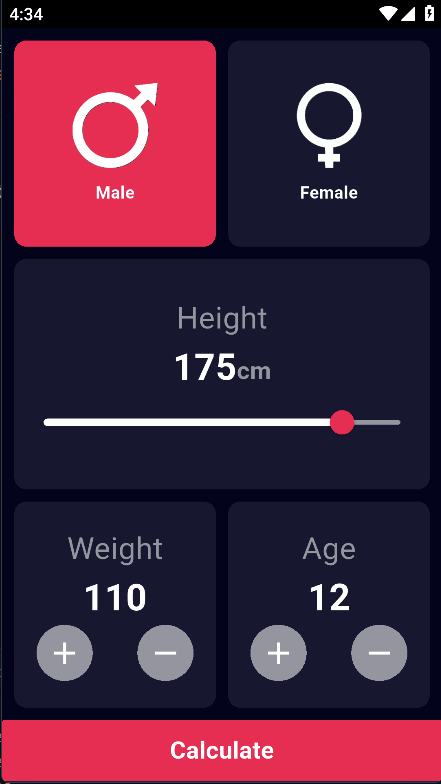
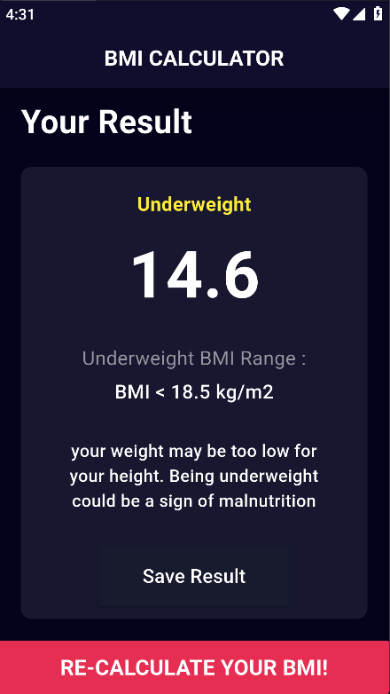
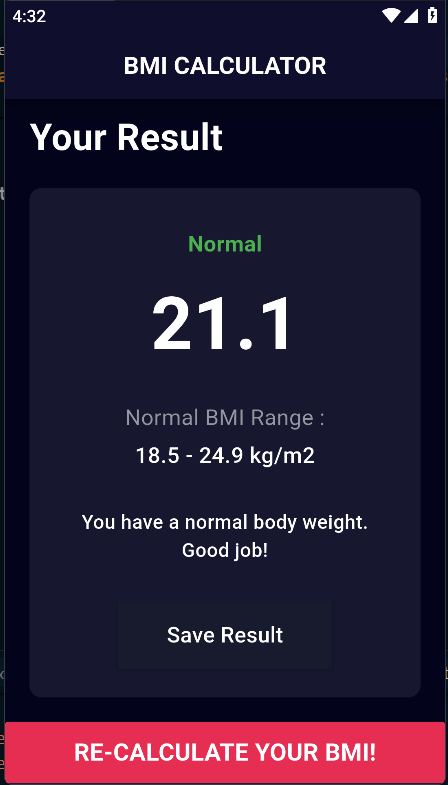
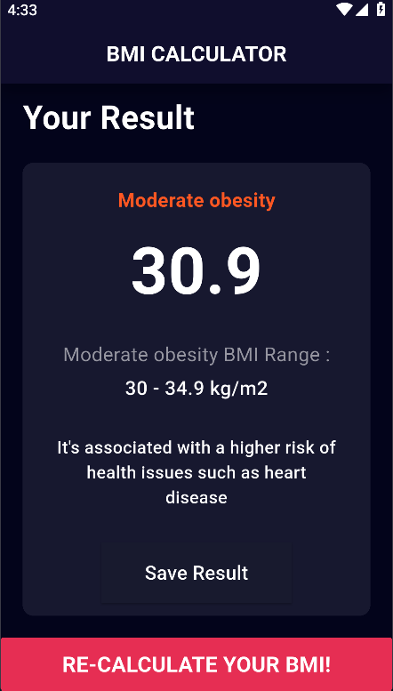

# BMI Calculator

A simple Body Mass Index (BMI) calculator app built with Flutter. This app allows users to input their height and weight, then calculates and displays their BMI along with a message indicating their health status.

## 🧮 Features

- Input height and weight
- Calculate BMI
- View health category based on BMI (Underweight, Normal, Overweight, etc.)
- Clean and responsive UI

## 📱 Screenshots

| | | |
|--|--|--|
|  |  |  |
|  |  |


## 🚀 Getting Started

### Prerequisites

- Flutter SDK installed
- Dart SDK installed
- An IDE like VS Code or Android Studio

### Installation

1. Clone the repository:

```bash
git clone https://github.com/your-username/bmi-calculator.git
